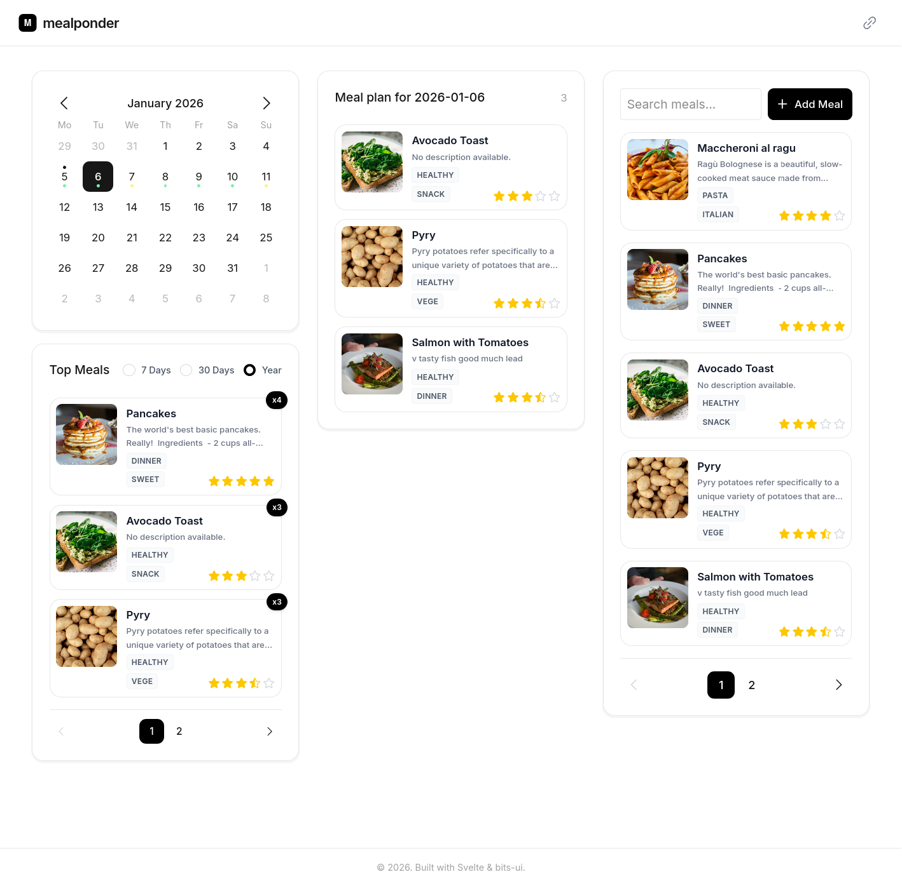
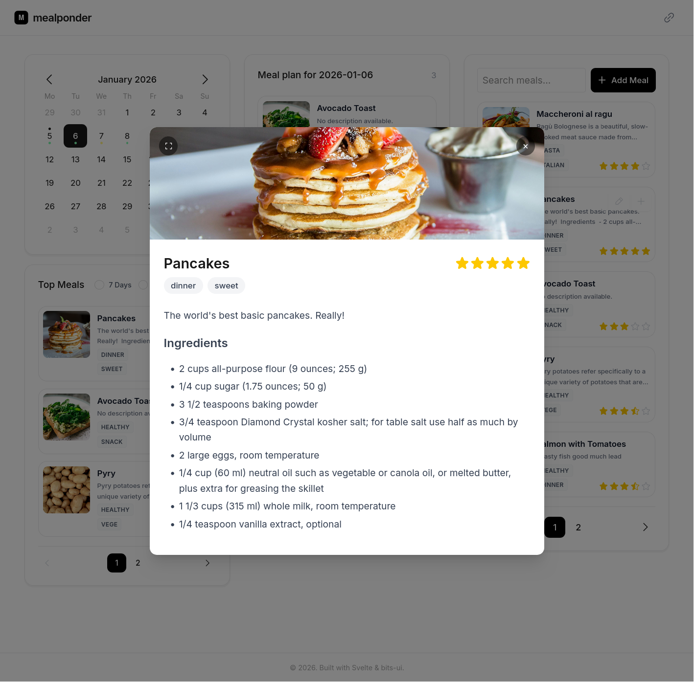
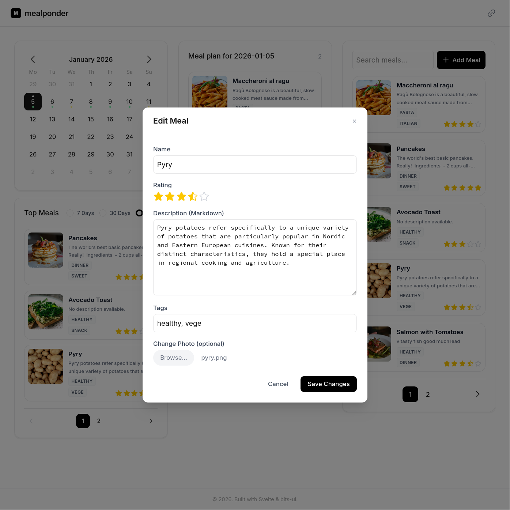

# mealponder

A modern, responsive meal planning application.
Organize your recipes, schedule meals for the week, and track your favorite dishes.







## Features

- **Interactive Calendar**: Visualize your meal schedule with a monthly calendar view. Day indicators show at a glance how many meals are planned.
- **Recipe Management**: Create, edit, and delete meals. Support for:
  - **Photos**: Upload images for your meals.
  - **Rich Text**: Write descriptions using **Markdown**.
  - **Tags**: Organize with tags (e.g., `#dinner`, `#healthy`).
  - **Ratings**: Star based rating system.
- **Search & Filter**: Find meals by name or tags.
- **Analytics**: View your most frequent meals.
- **Responsive Design**: Optimized layouts for both desktop and mobile devices.

## Getting Started

### Docker (recommended)

1.  **Clone the repository:**

    ```bash
    git clone https://github.com/pkoscik/mealponder.git
    cd mealponder
    ```

2.  **Start Docker setup:**

    ```bash
    docker compose up -d
    ```

### Local development

1.  **Clone the repository:**

    ```bash
    git clone https://github.com/pkoscik/mealponder.git
    cd mealponder
    ```

2.  **Install dependencies:**

    ```bash
    npm install
    ```

3.  **Start the development server:**

    ```bash
    npm run dev
    ```

4.  **Start the backend app:**

    ```bash
    cd backend
    uv venv .venv
    uv pip install -r requirements.txt
    uv run uvicorn app.main:app --reload --port 8000
    ```

5.  **Open your browser:**
    Navigate to `http://localhost:5173` to view the app.
